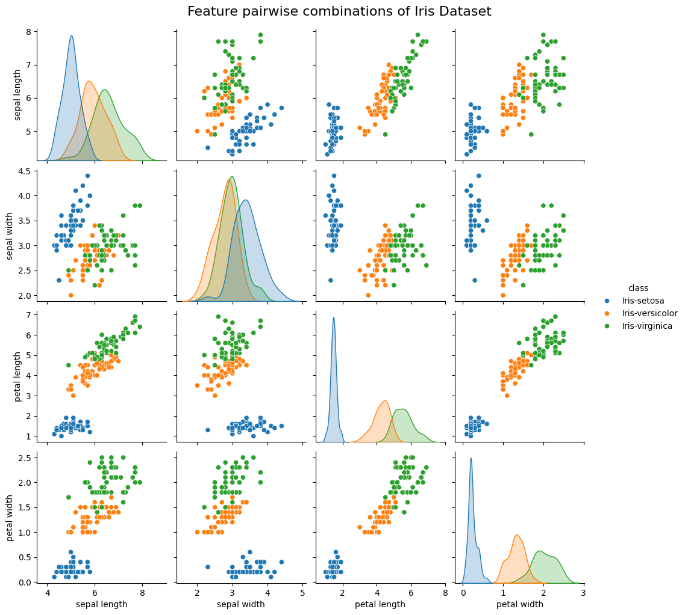
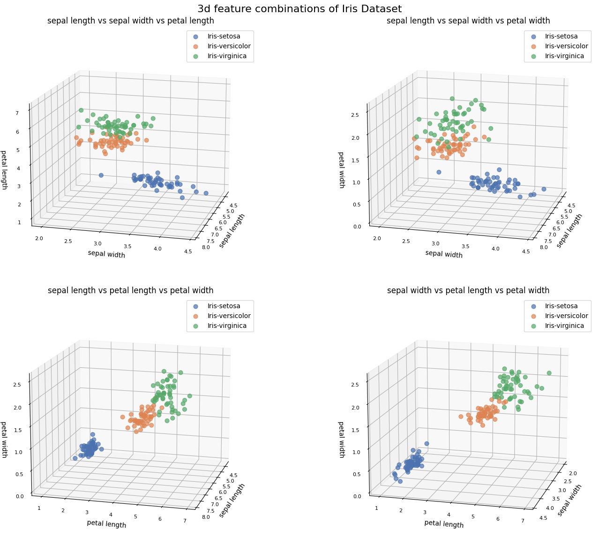
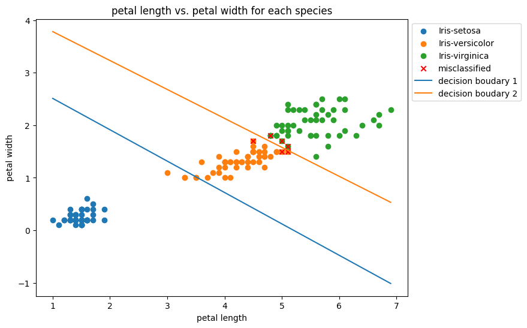
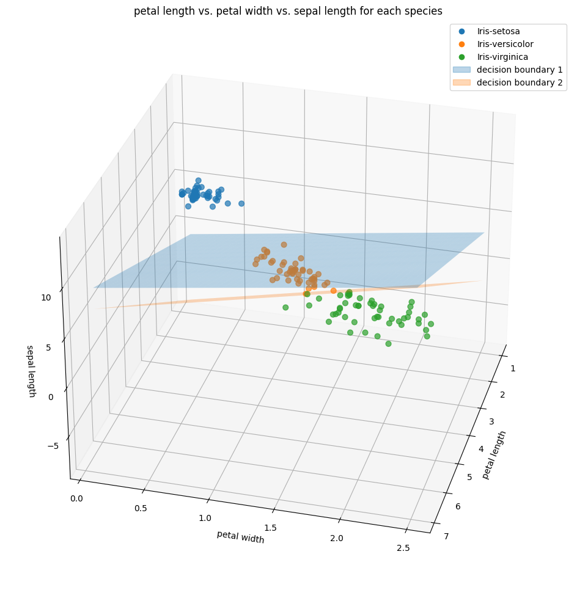

# Multiclass Logistic Regression
A Python implementation of multiclass logistic regression with focus on the statistical analysis of the coefficients.

## 1 - Objective
In this project we have implemented a Python-based module of the multiclass logistic regression method. Its purpose is purely pedagogical and to some extend it mirrors [scikit-learn's LogisticRegression class](https://scikit-learn.org/stable/modules/generated/sklearn.linear_model.LogisticRegression.html). The module gives some emphasis to the statistical analysis of the logistic regression coefficients. In particular, the code computes the standard errors and $Z$-statistics for the coefficients and their $p$-value against the hypothesis that there is no relation between dependent and preditor variables. These quantities are relevant to assess the accuracy for the estimation of the regression coefficients, the (linear) dependence of the *logit* with the predictors $X$ and the overall quality of the fit with the data. The module also produces the multiclass confusion matrix and some relevant classification scores.

## 2 - Repo organisation
**`logistic_regression/`: The linear regression modules**
- `logistic_regression.py`: The multiclass logistic regression module with its methods. See also Module architecture below.
- `_optimiser.py`: The optimisation module used to estimate the regression coefficients.
- `_utilities.py`: Functions used in the logistic regression and optimiser modules.

**`notebooks/:` Notebooks demonstrating the modules**
- `LogisticRegression.ipynb`: Notebook discussing the basics of the logistic regression 

## 3 - Module architecture
Description of the `logistic_regression` module architecture.
- `logistic_regression/__init__.py`
  - Initialises the module.
  - Imports the `LogisticRegressor` class, for multiclass logistic regression.

- `logistic_regression/logistic_regression.py`: defines the LogisticRegressor class with the methods
  - `fit`: use the `NewtonOptimiser` class;
  - `predict_proba`;
  - `predict`; 
  - `scores`;
  - `confusion_matrix`;
  - `get_params`;
  - `regression_report`.

- `logistic_regression/_optimiser.py`: defines the NewtonOptimiser class with the methods
  - `optimise`.

- `logistic_regression/_utilities.py`: defines the following functions used in the modules above.
  - `check_same_number_of_rows`;
  - `softmax`;
  - `one_hot_encoder`;
  - `kronecker_delta`. 

## 4 - Features
- The `LogisticRegressor` class:
  - performs logistic regression in multiclass problems by maximising the log-likelyhood function using the Newton-Raphson method assuming that the probabilities are modelled by the softmax function;
  - predicts the estimated probabilities for all classes for samples in the predictor values $X$;
  - predicts the class labels for samples in the predictor values $X$, with the predicted label corresponding to the one with the highest probability;
  - computes a number of classification scores and produces the confusion matrix for all classes;
  - produces a statistical analysis of the coefficient estimates;
  - has the following methods:
    - `fit` fits the logistic regression model,
    - `predict_proba` predicts the estimated probabilities, 
    - `predict` predicts the class labels using model,
    - `scores` returns the prevalence, precision, recall, true/false positive rates and accuracy scores,
    - `confusion_matrix` returns the confusion matrix for the classification problem,
    - `get_params` returns the estimation of the regression coefficients,
    - `regression_report` returns a report on the statistical analysis of the estimators's coefficients, with standard error, $Z$-statistics and $p$-value against the null hypothesis.

- The `NewtonOptimiser` class:
  - finds the maximum of the log-likelyhood function by searching the zero of the norm of the gradient vector;
  - has the following methods:
    - `optimise` executes the Newton-Raphson method.

## 5 - Results

To test and illustrate the `LogisticRegressor` module, we use the well-known [*Iris dataset*](https://en.wikipedia.org/wiki/Iris_flower_data_set). 

### 5.1 - Brief exploratory data analysis

Each sample in the Iris Dataset represents an iris plant. It contains 3 species of the plant (setosa, vericolor and virginica) with 50 instances. The features of each plant are the length and width in cm of the petal and sepal of the plant's flowers. 

We first make pairwise scatter plots of all the predictors in the dataset in order to visualise the clustering of the species in the 2d parameter spaces. 

  

*Figure 1: Pairwsie plot of the Iris Dataset features showing the clustering of each species.*

 
We make a triplewise scatter plots of all the predictors in the dataset in order to visualise the clustering of the species in the 3d parameter spaces. The aim is to verify is any further separation between the classes happens with respect to the 2d plots. 

 

  

*Figure 2: Triplewise plot of the Iris Dataset features showing the clustering of each species.*

 

The plots above allow us to infer the following.

 - The pairwise plot of the features indicates that with any two features the `Iris-setosa` can be clearly separated from the other two species.
 - The distribution plots show that the `Iris-versicolor` and `Iris-virginica` species have a better contrast for the `petal width` and `petal length` features. However, these features seem to be linearly correlated.
 - The distribution plot for `sepal length` show moderated contrast between the three species. Indeed, the 3d plot `sepal length` vs. `petal length` vs. `petal width` seems to show good separation between the species.

### 5.2 - Logistic regression

**Model with two predictors:** We first consider a model with only the `petal width` and `petal length` features as predictors. Below we have the results of the model in the 2d predictor space, confusion matrix, scores and regression report.

Using the methods `fit` and `predict`, the model predicts the class labels from the predictor samples $X$ by taking the class with highest probability.

 

  

*Figure 3: `petal width` vs. `petal length` plot for the predicted species, with the decision boudaries.*

 

Using the method `confusion_matrix`, the model returns the confusion matrix for the classification problem.

 

|                      | predicted Iris-setosa | predicted Iris-versicolor | predicted Iris-virginica |
|:--------------------:|:---------------------:|:-------------------------:|:------------------------:|
|   true Iris-setosa   |          50.0         |            0.0            |           0.0            |
| true Iris-versicolor |          0.0          |            47.0           |           3.0            |
| true Iris-virginica  |          0.0          |            3.0            |           47.0           |

*Table 1: Confusion matrix with `petal width` and `petal length` features as predictors.*

 

Using the method `scores`, the model returns the a table with a number of classification scores.

 

|        score        | class Iris-setosa | class Iris-versicolor | class Iris-virginica | all classes |
|:-------------------:|:-----------------:|:---------------------:|:--------------------:|:-----------:|
|      prevalence     |       0.3333      |         0.3333        |        0.3333        |     ---     |
|      precision      |        1.0        |          0.94         |         0.94         |     ---     |
|        recall       |        1.0        |          0.94         |         0.94         |     ---     |
|  true positive rate |        1.0        |          0.94         |         0.94         |     ---     |
| false positive rate |        0.0        |          0.06         |         0.06         |     ---     |
|       accuracy      |        ---        |          ---          |         ---          |     0.96    |

*Table 2: Scores with `petal width` and `petal length` features as predictors.*

 

Using the method `regression_report`, the model returns a regression report on the coefficients for each predictor. They are ordered as in the `n_class_` feature.

 

|           |          coefficient           |          std. error         |          z-statistics          | p-value |
|:---------:|:------------------------------:|:---------------------------:|:------------------------------:|:-------:|
| intercept |  [82.2308, 45.2723,  0.    ]   | [36.9121,  1.1114,  0.    ] |  [ 2.2277, 40.735,   0.    ]   |   0.0   |
|   coef_1  | [-15.7989,  -5.7545,   0.    ] | [32.8525,  0.1883,  0.    ] | [ -0.4809, -30.5642,   0.    ] |   0.0   |
|   coef_2  | [-26.4549, -10.4467,   0.    ] | [78.932,   0.3066,  0.    ] | [ -0.3352, -34.0674,   0.    ] |   0.0   |

*Table 3: Regression report with `petal width` and `petal length` features as predictors.*

 

**Model with three predictors:** We consider a model with the `petal width`, `petal length` and `sepal width` features as predictors. Below we have the results of the model in the 3d predictor space, confusion matrix, scores and regression report.

 

  

*Figure 4: `petal width` vs. `petal length` vs. `sepal width` plot for the predicted species, with the decision boudaries.*

 

|                      | predicted Iris-setosa | predicted Iris-versicolor | predicted Iris-virginica |
|:--------------------:|:---------------------:|:-------------------------:|:------------------------:|
|   true Iris-setosa   |          50.0         |            0.0            |           0.0            |
| true Iris-versicolor |          0.0          |            48.0           |           2.0            |
| true Iris-virginica  |          0.0          |            1.0            |           49.0           |

*Table 4: Confusion matrix with `petal width`, `petal length` and `sepal width` features as predictors.*

 

|        score        | class Iris-setosa | class Iris-versicolor | class Iris-virginica | all classes |
|:-------------------:|:-----------------:|:---------------------:|:--------------------:|:-----------:|
|      prevalence     |       0.3333      |         0.3333        |        0.3333        |     ---     |
|      precision      |        1.0        |         0.9796        |        0.9608        |     ---     |
|        recall       |        1.0        |          0.96         |         0.98         |     ---     |
|  true positive rate |        1.0        |          0.96         |         0.98         |     ---     |
| false positive rate |        0.0        |          0.02         |         0.04         |     ---     |
|       accuracy      |        ---        |          ---          |         ---          |     0.98    |

*Table 5: Scores with `petal width`, `petal length` and `sepal width` features as predictors.*

 

|           |          coefficient           |           std. error           |          z-statistics          | p-value |
|:---------:|:------------------------------:|:------------------------------:|:------------------------------:|:-------:|
| intercept |  [33.4445, 40.831,   0.    ]   | [260.6473,   1.5145,   0.    ] |  [ 0.1283, 26.961,   0.    ]   |   0.0   |
|   coef_1  | [-22.5655,  -9.7544,   0.    ] |  [38.2751,  0.3646,  0.    ]   | [ -0.5896, -26.7552,   0.    ] |   0.0   |
|   coef_2  | [-23.8184, -10.1016,   0.    ] |  [67.578,   0.3761,  0.    ]   | [ -0.3525, -26.8596,   0.    ] |   0.0   |
|   coef_3  |  [13.4729,  3.8387,  0.    ]   |  [61.4973,  0.1739,  0.    ]   |  [ 0.2191, 22.0739,  0.    ]   |   0.0   |

*Table 6: Regression report with `petal width`, `petal length` and `sepal width` features as predictors.*

 

### 5.3 - Conclusions

 - We do not consider a test set as our aim is to test our module rather than the efficient of thelogistic regression in this dataset.
 - The model can easily separate the `Iris-setosa` species from the `Iris-vericolor` and `Iris-virginica` species, as expected from the pair and triple plots.
 - The addition of the `sepal width` feature as predictor increases the efficience of the logistic regression model.
 - The classification scores produced by our module are in line with expected for logistic regression on the Iris Dataset, see [here](https://archive.ics.uci.edu/dataset/53/iris).

## 6 - Bibliography

- G. James, D. Witten, T. Hastie and R. Tibshirani, *An Introduction to Statistical Learning*, Springer (2017).
- T. Hastie, R. Tibshirani and J. Friedman, *The Elements of Statistical Learning: Data mining, Inference, and Prediction*, Springer (2017).
- M.N. Magalhães and A.C. Pedroso de Lima, *Noções de Probabilidade e Estatística*, Edusp (2023).
- R. A. Fisher, ["Iris", UCI Machine Learning Repository](https://archive.ics.uci.edu/dataset/53/iris) (1936).
